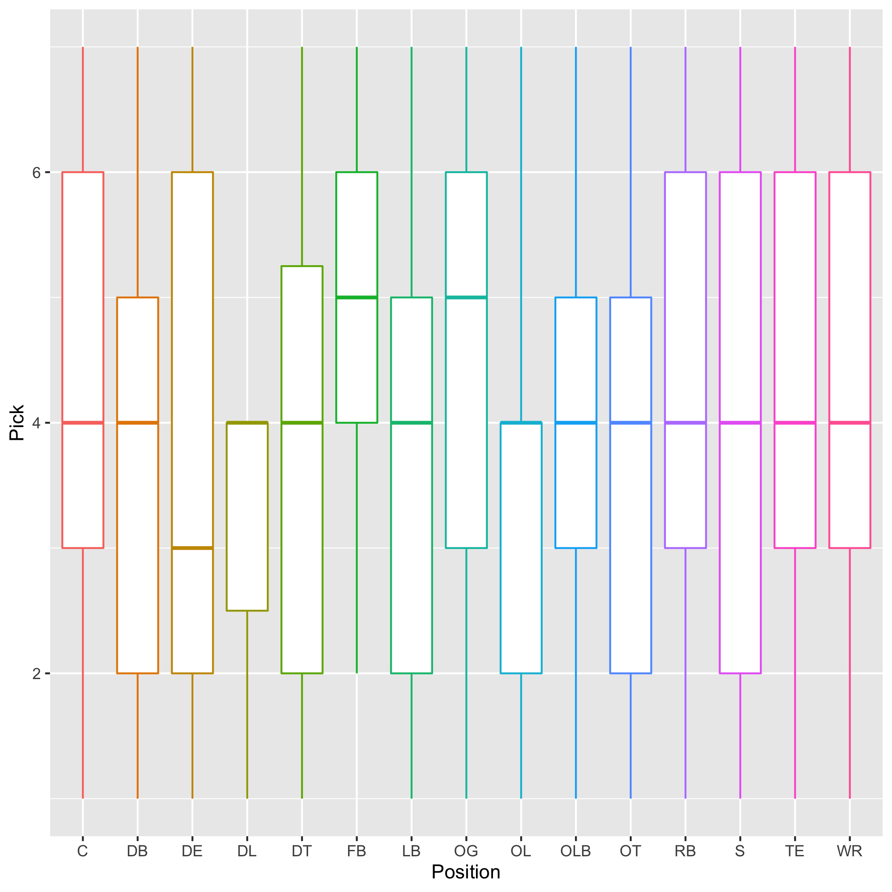
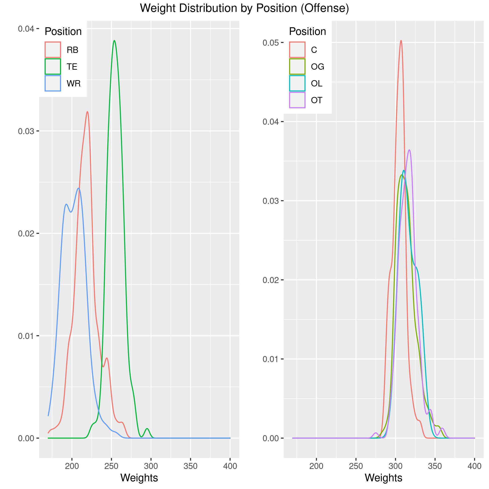
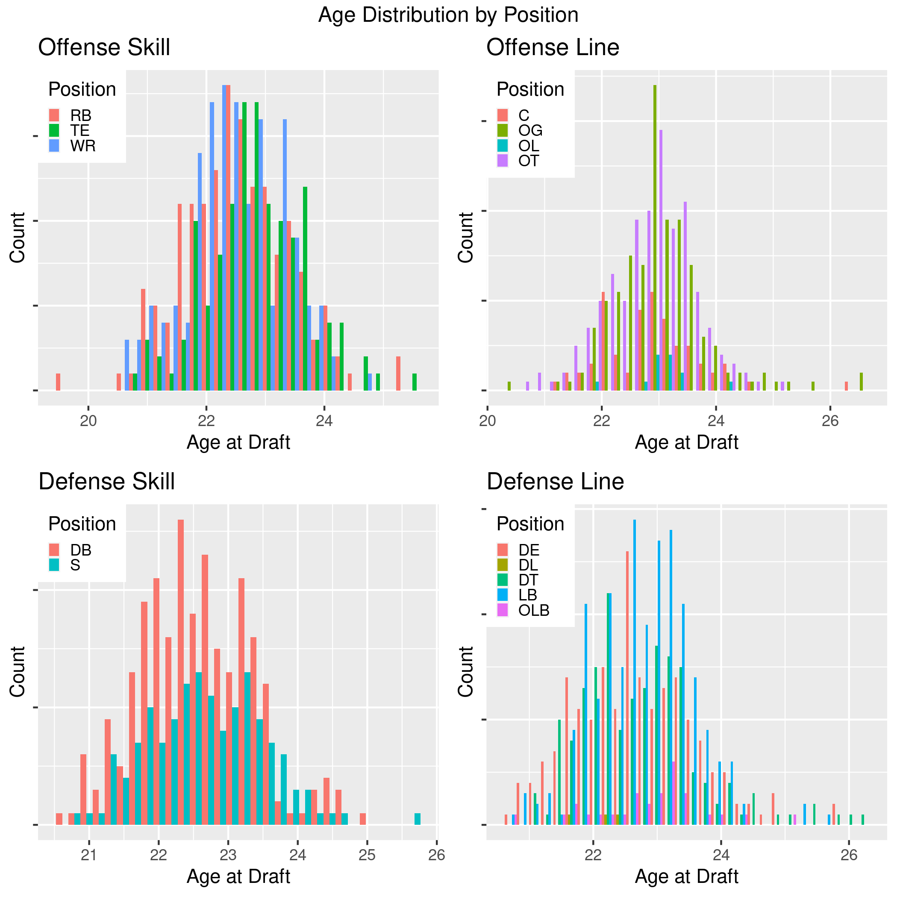
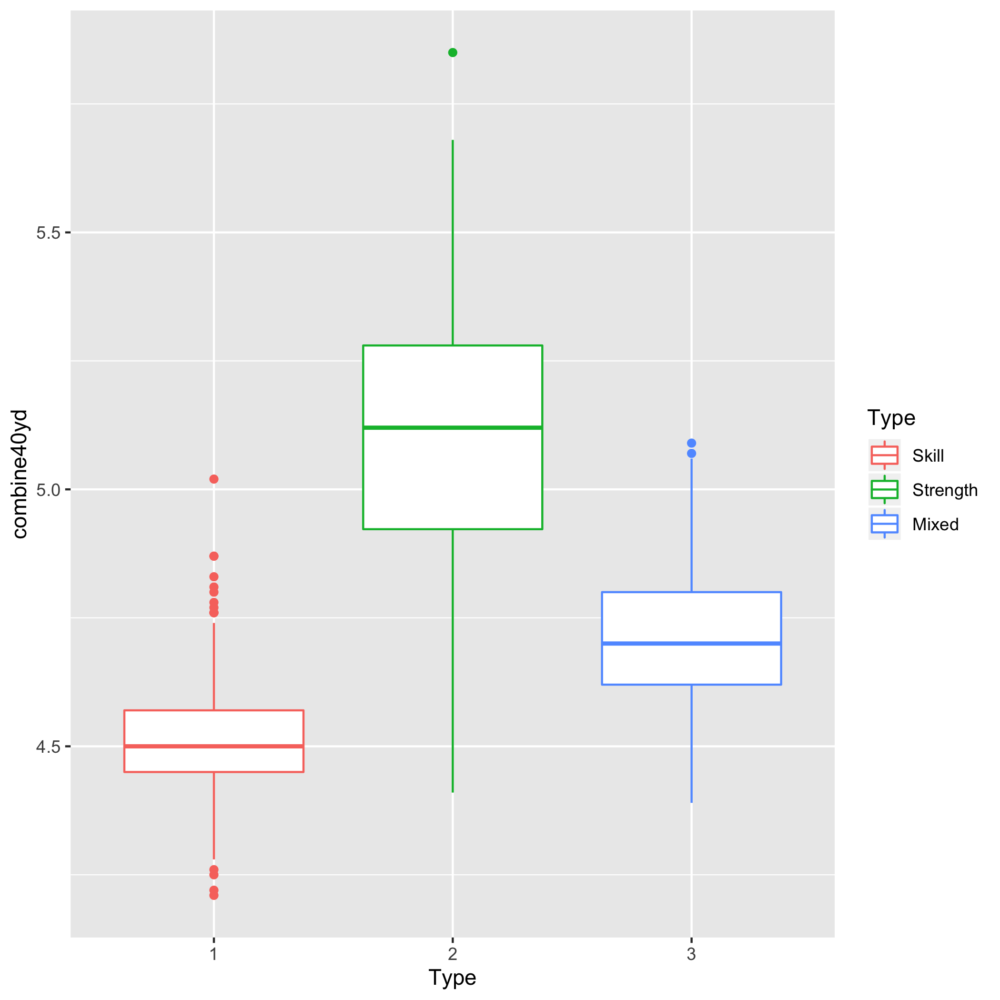
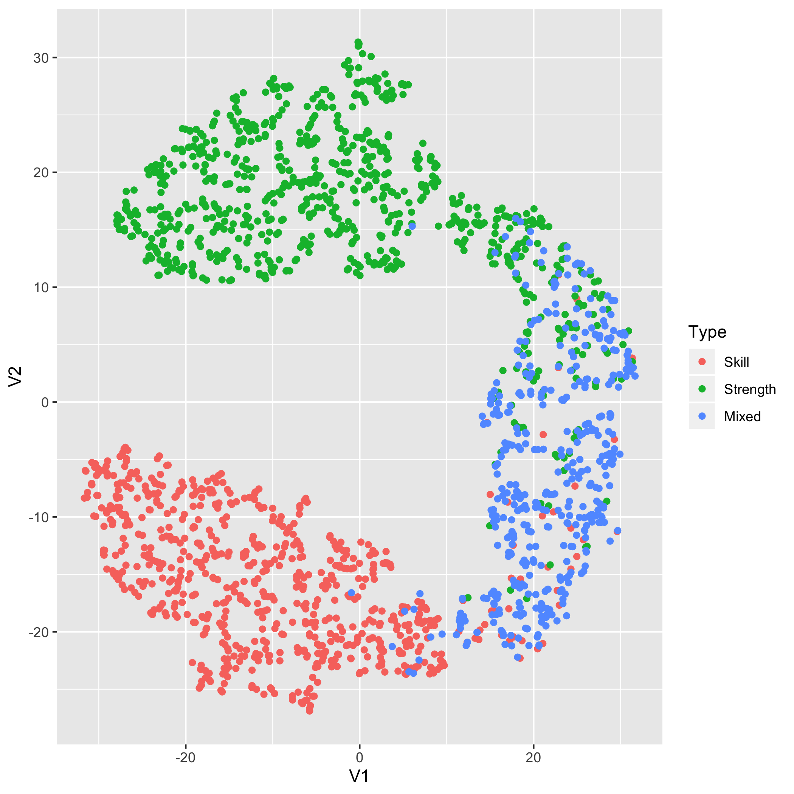
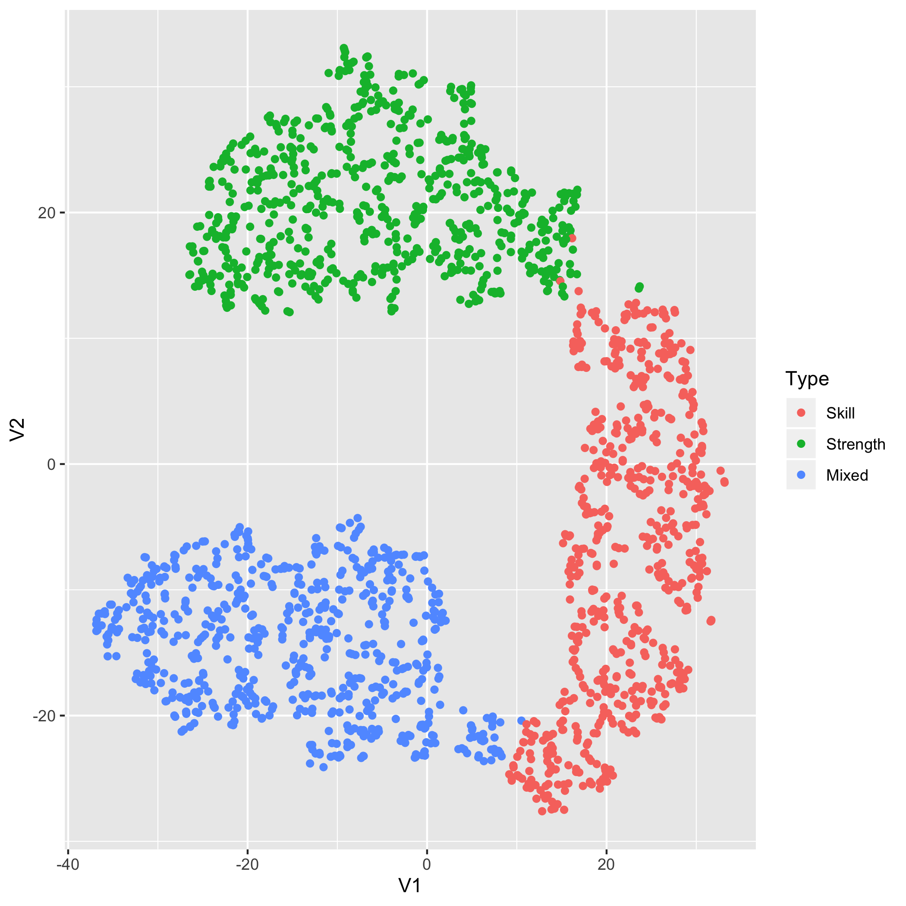

```{r setup, include=FALSE}
knitr::opts_chunk$set(echo = TRUE)
library(knitr)
```

Introduction
============

The NFL Draft is one of the of the biggest sport drafts in the world. Teams will spend millions of dollars on players that they think will help their team win and reach the Superbowl. With all this money changing hands, comes a lot of risk and a lot of questions about what stats are important for deciding what players to draft. The NFL combine allows teams to see how players match up against each other in physical challenges such as the benchpress and the 40yd dash. Teams will use the results of these tests, along with college stats and performance, to decide if and when they should draft a player. 
  
  This project will shed light on what combine stats are most important for deciding when a player should be drafted dependent on the position of the player. Using predictive modeling techniques and machine learning, we will attempt to predict when a player will get drafted based on their performance in the combine and their position. Also, clustering methods will be used to asses the following hypothesis:
  
### Hypothesis
Hypothesis: There are three types of players that enter the NFL Draft. Skill, Strength, and Mixed. 

Explanation: A variable called "Type" has been added to denote the type of player. "Type" could be one of the following three options: Skill, Strength, Mixed. These columns were added as a hypothesis that these are the three types of players in the combine. Skill players are those that entered the combine as a WR, RB, S, CB. Strength are C, OG, OL, OT, DE, DT, DL. Mixed are LB, OLB, TE. These seemed fitting initially because of their relative positions on the field when the ball is snapped. 
  
Data
====

The two data sets used are combine.csv and draft.csv from: <br/ >
https://www.kaggle.com/toddsteussie/nfl-play-statistics-dataset-2004-to-present 

### Data Cleaning and Joining

Only data from the years 2000-present are used for analysis. The NFL has changed significantly from the 1960s, this suggests only recent data is relevant for prediction. Data was split, tagged with "Type" column to test hypothesis previously stated, and rejoined to form prediction data set.

The following plots contain summary information for the data set. 






Methodology
===========

Clustering
----------

After suspecting there were three distinct groups, I tested this hypothesis with three clustering methods: TSNE, K-Means, and Principle Component Analysis (PCA). 

### TSNE

TSNE provided intial insight into the suspected clusters in the data. Since TSNE is non-linear, it could not be said for sure that these three groups truly existed. 

### K-Means

K-Means provides evidence that these clusters truly exist. There is little overlap between the three groups and there are clear centers in each of the clusters. 

### PCA

The PCA further justifies accpeting the hypothesis that there are indeed three groups of players in the NFL Draft. This plot shows the primary principle component plotted against the secondary principle component. 

### Clustering Analysis Conclusion

These three clustering analyses justify the conclusion that there are three groups of players. Intutitively it makes perfect sense as well. Running-back, Receiver, Safety, and cornerback are all positions known for speed and agility. These players would perfrom especially well in the 40yd dash, 3cone, and shuttle run drills during the combine. On the other hand, lineman on offense and defense need to be exceedingly strong and thus perform well at the benchpress. Also, since weight and height are assesed at the combine they are used to build these clusters. 

Modeling
--------

We attempt to predict pick from the set of combine times as well as the height, weight, and age of the player. This basic full regression formula is as follows: <br />

Pick ~ Weight + Height + combine40yd + combineBench + combineVert + combine3cone + combineShuttle + combineBroad + $\epsilon$. <br />

This is done using multiple different regression techniques. Below is a table displaying the results of model. Models are assessed using RMSE and Rsquared of predicitons on validation set. 

```{r, echo = F}
readRDS("derived_graphs/RMSE.Table.rds")
```

According to the table, the random forest model seemed to perfrom the best on the out of sample validation set. The importance of each variable in the random forest model is detailed below. 

```{r, echo = F}
readRDS("derived_graphs/rf.importance.table.rds")
```

