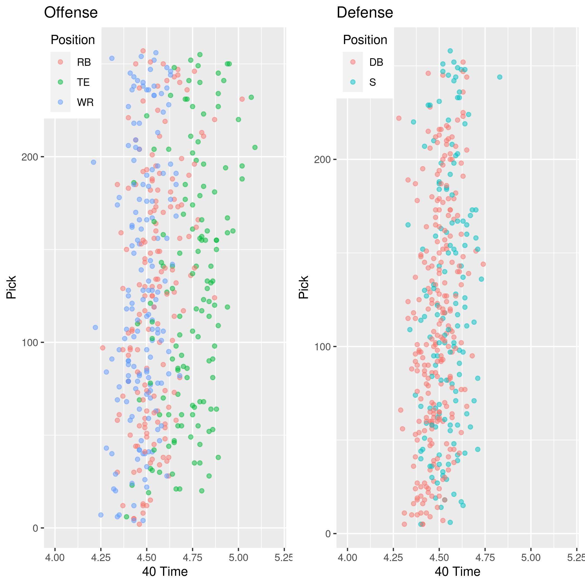

BIOS 611 NFL Project 1
======================

PROPOSAL
--------

#### INTRODUCTION:
  
  The NFL Draft is one of the of the biggest sport drafts in the world. Teams will spend millions of dollars on players that they think will help their team win and reach the Superbowl. With all this money changing hands, comes a lot of risk and a lot of questions about what stats are important for deciding what players to draft. The NFL combine allows teams to see how players match up against each other in physical challenges such as the benchpress and the 40yd dash. Teams will use the results of these tests, along with college stats and performance, to decide if and when they should draft a player. 
  
  This project will shed light on what combine stats are most important for deciding when a plyer should be drafted dependent on the position of the player. Using predictive modeling techniques and machine learning, we will attempt to predict when a player will get drafted based on their performance in the combine and their position. 

#### Datasets:

  The datasets used are combine.csv and draft.csv taken from Kaggle at: https://www.kaggle.com/toddsteussie/nfl-play-statistics-dataset-2004-to-present 
  
  The datasets are joined and filtered to only include complete observations from the year 2000 on.
  
#### Preliminary Figures:

The figure above shows boxplots for each position by the round the player was picked. Offensive lineman seam to be taken early than other positions. WRs, TEs, and RBs are often taken later. 

The figure above shows 40 times against pick taken in the draft for skill position players on offense and defense. There seems to be a slight exponential trend showing that player who ran slower got picked slightly later. Also, WRs and RBs seems to be the fastest in the draft. 

The figure above shows the distribution of weights for offensive players in the draft. WRs seems to have the smallest average weight, while the offenseive lineman all weight similarily. 

The figure above shows the age distribution of players when they enter the draft categorized by position. Most players seem to be between 22 and 24. It would be interesting to see the effect age has on pick. 

USAGE
-----
You'll need Docker and the ability to run Docker as your current user.

You'll need to build the container:

    > docker build . -t project-env

This Docker container is based on rocker/verse. To run rstudio server:

    > docker run -v `pwd`:/home/rstudio -p 8787:8787\
      -e PASSWORD=mypass -t project-env
      
Then connect to the machine on port 8787.